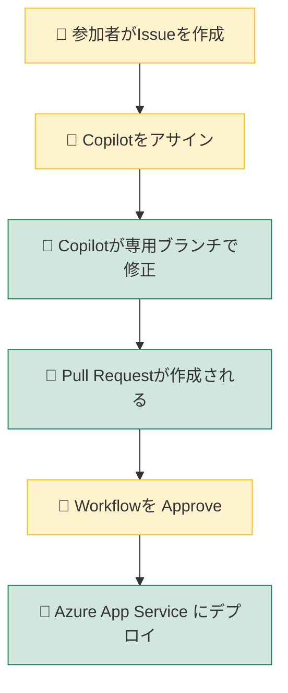
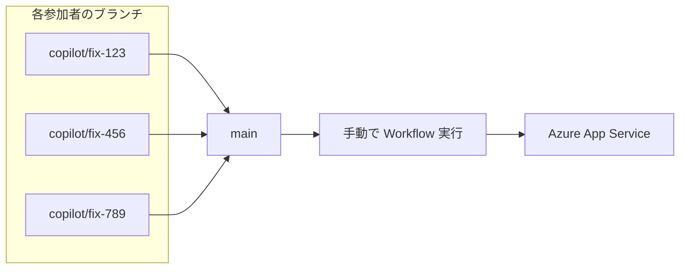

# IssueDrivenWorkshop

Blazor Server アプリケーションのサンプルプロジェクトです。Azure Table Storage を使用した経費申請システムを実装しています。

## 技術スタック

- **フレームワーク**: Blazor Server (.NET 8)
- **データストア**: Azure Table Storage

## セットアップ

### 1. リポジトリをクローン

```bash
git clone https://github.com/your-username/IssueDrivenWorkshop.git
cd IssueDrivenWorkshop
```

### 2. 設定ファイルを作成

テンプレートファイルをコピーして、接続文字列を設定してください。

```bash
cp appsettings.Development.json.template appsettings.Development.json
```

`appsettings.Development.json` を編集し、Azure Table Storage の接続文字列を設定：

```json
{
  "AzureTableStorage": {
    "ConnectionString": "<YOUR_CONNECTION_STRING>",
    "TableName": "Expenses"
  }
}
```

### 3. アプリケーションを実行

```bash
dotnet run
```

ブラウザで `https://localhost:7123` にアクセスしてください。

## プロジェクト構成

```
IssueDrivenWorkshop/
├── Components/
│   ├── Pages/          # Razorページ
│   ├── Layout/         # レイアウトコンポーネント
│   └── _Imports.razor  # 共通インポート
├── Models/             # エンティティモデル
├── Services/           # ビジネスロジック・データアクセス
└── wwwroot/            # 静的ファイル
```

## 開発ガイドライン

[.github/copilot-instructions.md](.github/copilot-instructions.md) を参照してください。

## CI/CD（GitHub Actions）

`main` ブランチへの Pull Request 作成時、または手動トリガーで Azure App Service にデプロイされます。

### セットアップ手順

1. **Azure App Service を作成**
2. **発行プロファイルを取得**: Azure Portal → App Service → 発行プロファイルのダウンロード
3. **GitHub に登録**: リポジトリ → Settings → Secrets and variables → Actions
   - **Variables** タブ:
     - `AZURE_WEBAPP_NAME`: App Service の名前
   - **Secrets** タブ:
     - `AZURE_WEBAPP_PUBLISH_PROFILE`: 発行プロファイルの内容

## ワークショップでの並行作業について

複数名で同時に作業する場合の注意事項です。

### 作業フロー



- 👤 **黄色**: 参加者が手動で行う操作
- 🤖 **緑色**: 自動で実行される処理

1. **Issue 作成**: 各参加者が修正内容を Issue として記載
2. **Copilot アサイン**: Issue に Copilot をアサイン
3. **自動修正**: Copilot が専用ブランチを作成し、コードを修正
4. **PR 作成**: 修正完了後、Pull Request が自動作成される
5. **デプロイ**: Workflow を Approve すると Azure App Service にデプロイ

### ⚠️ 並行デプロイ時の注意（後勝ち）

複数の参加者が同時に Workflow を Approve してデプロイすると、**同じ Azure 環境に対して後からデプロイした内容が反映されます**（後勝ち）。

```
参加者A: デプロイ開始 ────────> 完了（反映）
参加者B:     デプロイ開始 ────────> 完了（上書き）← この内容が最終的に反映
```

今回のワークショップでは、シンプル化のためこの動作を許容しています。

> 💡 **本番環境では？**  
> 以下のような方法で並行デプロイの競合を回避できます。
> - **デプロイスロット**: ステージングスロットにデプロイ → 検証後にスワップ
> - **環境の分離**: 開発者ごと・ブランチごとに別の App Service を用意
> - **デプロイキュー**: GitHub Actions の `concurrency` 設定でデプロイを直列化

### 全員の変更をまとめてデプロイする場合

並行して作成された複数のブランチの変更を統合したい場合は、以下の手順で行います。



1. **各 PR を `main` ブランチにマージ**
   - コンフリクトがある場合は解消してからマージ

2. **Workflow を手動実行**
   - GitHub → **Actions** タブ → **Deploy to Azure** を選択
   - **Run workflow** ボタンをクリック
   - ブランチ: `main` を選択して実行

これにより、全員の変更が統合された状態で Azure にデプロイされます。

## ライセンス

MIT License
